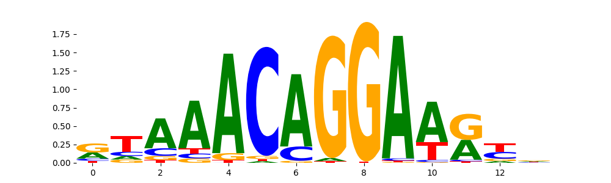
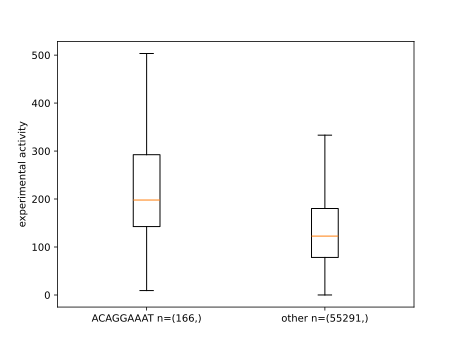
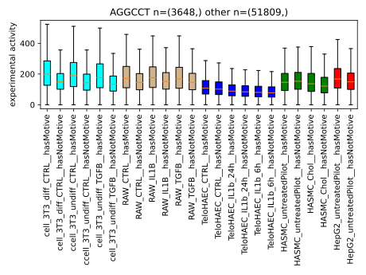

# STARseqCNN

2beupdated: santity check and heatmap scripts + final model is the one with "all-seq"-> also needs to be updated; variant effects haplo types docu ind readme

This repository contains and describes code used to train, evaluate, and interprete multi task STARseq CNNs based on STARseq data from multiple experimental set-ups provided by the [Kaikkonen Lab](https://uefconnect.uef.fi/en/group/cardiovascular-genomics-kaikkonen-lab/). The folder `finalModel` contains the trained model used for further analysis described in the manuscript. It can be loaded in an existing python script using `model=keras.models.load_model("allseq-CNN_StarSeq_model_Minna_deepSTAR_lr0.01no_aug")`. This readme describes how to use the code given in this repository. A series of bash commands to execute the entire workflow is given at the end.

## Worklflow CNN training, evaluation, and interpretation

### Clone this repository
Use `git clone https://github.com/ThorbenMaa/STARseqCNN.git`. Operate from inside the directory.

### Install dependencies
I recommend to use [mamba](https://mamba.readthedocs.io/en/latest/installation.html) to create environments and install dependencies:

```
mamba env create --name CNN_TM --file=./envs/CNN_TM.yml
mamba env create --name modisco_lite --file=./envs/modisco_lite.yml
```

### Load and plot experimental labels and corresponding sequences (will be added upon publication)
also needs ot be added in the "workflow in comments" section

First, activate the `CNN_TM` environment using `mamba activate CNN_TM`. Download the data using `wget -c xxxx`. For getting an idea on the experimental data, use the script `corr_heatmap_labels.py` (Descripion and example command given in script). The script will plot a correlation heatmap. The figure will look like this:(will be added later)

### Train CNNs
First, activate the `CNN_TM` environment using `mamba activate CNN_TM`.
You can either directly run `train_or_eval_CNNs.py` in the "train" mode (documentation and example bash commands provided in the script) or run the script using slurm within an sbatch script. An example with reasonable recources is given in `sbtachTrain_CNN_TM.sh` (example bash command given in script). 

The script prints a lot of information. Among others, after each training, it will print the perfromance on a hold-out test data set. The model with the best perfromance can than be used for further analysis.
In the manuscript, the [DeepSTAR](https://colab.research.google.com/drive/1Xgak40TuxWWLh5P5ARf0-4Xo0BcRn0Gd)-like architecture with a learning rate of 0.001 was chosen. 

### Further evaluate CNNs
First, activate the `CNN_TM` environment using `mamba activate CNN_TM`.
This can be done using the `train_or_eval_CNNs.py` script in the "load" mode (documentation and example bash commands provided in the script). The script will calculate pearson correlations between 
predicted and experimental STARseq activity and plot corresponding scatter plots.

### In-silico-mutagenisis (ISM) for model interpretation with tfmodisco-lite
First, activate the `CNN_TM` environment using `mamba activate CNN_TM`.
You can use the `ism_TM.py` script to generate one-hot-encoded sequences and the corresponding raw CNN scores in a format suitable for tfmodisco-lite for all experimental set-ups explained in the manuscript. Note that the CNN raw scores can not be directly used
for tfmodisco-lite but have to be further processed using `modisco_TM.py` (documentation and example bash commands provided in the respective scripts). To make use of slurm, you can also use an sbatch script provided in `sbatch_ism.sh`. 

### Model interpretation using tfmodisco-lite - motifs learned by the model and comparing them to known motifs
First, activate the `modisco_lite` environment using `mamba activate modisco_lite`.
Use the script `mosidco_TM.py` with the .npz files generated in the previous step by the `ism_TM.py` script as inputs (documentation and example bash commands provided in the respective scripts). The script will create a tfmodisco-lite result.h5 file. 
You can create tfmodisco-lite reports from this results file using e.g.:
```
# Download JASPAR
wget https://jaspar.genereg.net/download/data/2022/CORE/JASPAR2022_CORE_vertebrates_non-redundant_pfms_meme.txt

# make JASPAR file nice so that the TF names appear in the final report (credits to Max Schubach, BIH, Germany)
cat JASPAR2022_CORE_vertebrates_non-redundant_pfms_meme.txt | awk '{{if ($1=="MOTIF") {{print $1,$2"_"$3,$3}} else {{print $0}}}}' > JASPAR2022_CORE_vertebrates_non-redundant_pfms_meme_nice.txt

# create reports
modisco report -i modisco_resultshypothetical_contribution_scores_mean_HASMC_Chol.npz.h5 -o report_HASMC_chol/ -s report_HASMC_Chol/ -m JASPAR2022_CORE_vertebrates_non-redundant_pfms_meme_nice.txt
```
You can also use an sbatch script provided in `sbatch_tfmodisco.sh` to make use of slurm. Here, all commands for generating tfmodisco results and reports used for the analysis of the manuscript are listed. 

More information on how to use tfmodisco-lite is given at the corresponding [github repository](https://github.com/jmschrei/tfmodisco-lite/tree/main). More information on the ISM approach can be found at this [paper](https://genomebiology.biomedcentral.com/articles/10.1186/s13059-022-02811-x) by Agarwal and Kelley, 2022.

The motifs the model has learned can look like this:


In this case, the motif matches a known motif from the JASPAr data base:


### Sanity check
Has the CNN really learned motifs that enhance/repress activity in the STARseq experiment? First, activate the `CNN_TM` environment using `mamba activate CNN_TM`. You can use the `sanity_check_modisco_results.py` script to plot experimental activity within one cell type of sequences containing a motif of interest or not (documentation and example bash command provided in the script). The result will look like this:


As you can see, sequences in the data set containing ACAGGAAAT tend to have a higher experimental activity compared to sequences that don't contain this motif.

You can also use the script `sanity_check_modisco_results_cellTypeComp.py` to plot the activity of a (or multiple) particular motifs across all cell types and experimental set ups. This may help you to decide whether a motif of interest acts in a cell tyoe specific way. The rsult will look like this:


As you can see, the AGGCCT motif appears to be specific for some cell types and experimental set ups, but not for others.

You can also calculate the correlations of the difference in experimental activity measured for all sequences and their haplotypes and the corresponding predicted activity differences by using the script `sanityCheck_variantEffects.py`. Example commands are given in the script. You can either use the entire data set or the test data set only. To make use of slurm, an examplary script is given with `sbatch_sanityCheck_variantEffects.sh`.

## The workflow in bash commands
2beupdated: santity check and heatmap scripts
> ```
> # clone repo
> git clone https://github.com/ThorbenMaa/STARseqCNN.git
>
> # change into new directory
> cd STARseqCNN
>
> # install dependencies
> mamba env create --name CNN_TM --file=./envs/CNN_TM.yml
> mamba env create --name modisco_lite --file=./envs/modisco_lite.yml
>
> # download and plot data
> mamba activate CNN_TM
> wget blablabla.com
> python corr_heatmap_labels.py 2023-01-10_22-29-33\ myCounts.minDNAfilt.depthNorm.keepHaps\ -\ starr.haplotypes.oligo1.txt starrseq-all-final-toorder_oligocomposition.csv
> 
> # train models
> mamba activate CNN_TM
> sbatch sbatch_Train_CNN_TM.sh
>
> # or use final model given in this repository
> mv finalModel/allseq-CNN_StarSeq_model_Minna_deepSTAR_lr0.01no_aug
> 
> # further evaluate best model
> mamba activate CNN_TM
> python train_or_eval_CNNs.py 2023-01-10_22-29-33\ myCounts.minDNAfilt.depthNorm.keepHaps\ -\ starr.haplotypes.oligo1.txt starrseq-all-final-toorder_oligocomposition.csv load allseq-CNN_StarSeq_model_Minna_deepSTAR_lr0.01no_aug chr8 no_aug 2023-01-10_22-29-33\ myCounts.minDNAfilt.depthNorm.keepHaps\ -\ starr.haplotypes.oligo2.txt
> 
> # ISM
> mamba activate CNN_TM
> sbatch sbatch_ism.sh
> 
> # tfmodisco-lite
> mamba activate modisco_lite
> wget https://jaspar.genereg.net/download/data/2022/CORE/JASPAR2022_CORE_vertebrates_non-redundant_pfms_meme.txt
> cat JASPAR2022_CORE_vertebrates_non-redundant_pfms_meme.txt | awk '{{if ($1=="MOTIF") {{print $1,$2"_"$3,$3}} else {{print $0}}}}' > JASPAR2022_CORE_vertebrates_non-redundant_pfms_meme_nice.txt
> sbatch sbatch_tfmodisco.sh
> 
> # sanity check of selected motifs within one experimental set up
> mamba activate CNN_TM
> python sanity_check_modisco_results.py 2023-01-10_22-29-33\ myCounts.minDNAfilt.depthNorm.keepHaps\ -\ starr.haplotypes.oligo1.txt starrseq-all-final-toorder_oligocomposition.csv HASMC_Chol
>
> # ...or within all set-ups
>python sanity_check_modisco_results_cellTypeComp.py 2023-01-10_22-29-33\ myCounts.minDNAfilt.depthNorm.keepHaps\ -\ starr.haplotypes.oligo1.txt starrseq-all-final-toorder_oligocomposition.csv 2023-01-10_22-29-33\ myCounts.minDNAfilt.depthNorm.keepHaps\ -\ starr.haplotypes.oligo2.txt
>
> # ...or by looking at haplotype differences in the entire training data set
> sbatch sbatch_sbatch_sanityCheck_variantEffects.sh
> ```
>

