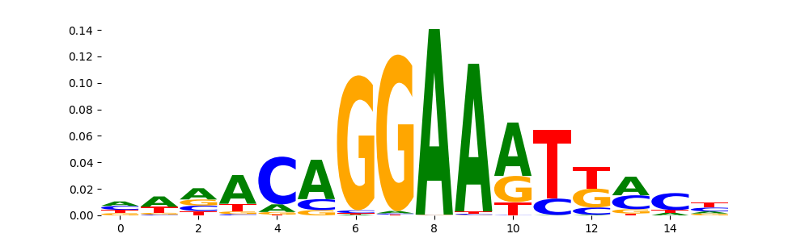
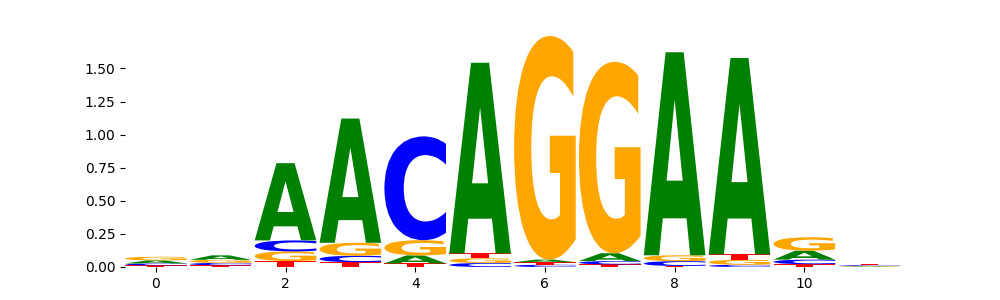
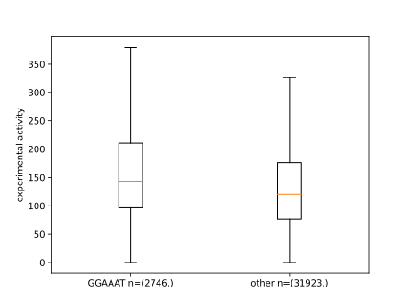

# STARseqCNN
This repository contains and describes code used to train, evaluate, and interprete multi task STARseq CNNs based on STARseq data from multiple experimental set-ups provided by the Kaikkonen lab. The folder `finalModel` contains the tarined model used for further analysis in the manuscript.

## Worklflow

### Clone this repository
Use `git clone https://github.com/ThorbenMaa/STARseqCNN.git`. Operate from inside the directory.

### Install dependencies
I recommend to use mamba to create environments and install dependencies:

```
mamba env create --name CNN_TM --file=./envs/CNN_TM.yml
mamba env create --name modisco_lite --file=./envs/modisco_lite.yml
```

### load experimental labels and corresponding sequences (will be added upon publication)

### train CNNs
First, activate the `CNN_TM` environment using `mamba activate CNN_TM`.
You can either directly run `train_or_eval_CNNs.py` in the "train" mode (documentation and example bash commands provided in the script) or run the script using slurm within an sbatch script. An example with reasonable recources is given in `sbtachTrain_CNN_TM.sh` (example bash command given in script). 

The script prints a lot of information. Among others, after each training, it will print the perfromance on a hold-out test data set. The model with the best perfromance can than be used for further analysis.
In the manuscript, the DeepSTAR-like architecture with a learning rate of 0.001 was chosen. 

### further evaluate CNNs
First, activate the `CNN_TM` environment using `mamba activate CNN_TM`.
This can be done using the `train_or_eval_CNNs.py` script in the "load" mode (documentation and example bash commands provided in the script). The script will calculate pearson correlations between 
predicted and experimental STARseq activity and plot corresponding scatter plots.

### In-silico-mutagenisis (ISM) for model interpretation with tfmodisco-lite
First, activate the `CNN_TM` environment using `mamba activate CNN_TM`.
You can use the `ism_TM.py` script to generate one-hot-encoded sequences and the corresponding raw CNN scores in a format suitable for tfmodisco-lite for all experimental set-ups explained in the manuscript. Note that the CNN raw scores can not be directly used
for tfmodisco-lite but have to be further processed using `modisco_TM.py` (documentation and example bash commands provided in the respective scripts). To make use of slurm, you can also use an sbatch script provided in `sbatch_ism.sh`. 

### Model interpretation using tfmodisco-lite - motifs learned by the model and comparing them to known motifs
First, activate the `modisco_lite` environment using `mamba activate modisco_lite`.
Use the script `mosidco_TM.py` with the .npz files generated in the previous step by the `ism_TM.py` script as inputs (documentation and example bash commands provided in the respective scripts). The script will create a tfmodisco-lite result.h5 file. 
You can create tfmodisco-lite reports from this results file using e.g.:
```
wget https://jaspar.genereg.net/download/data/2022/CORE/JASPAR2022_CORE_vertebrates_non-redundant_pfms_meme.txt
modisco report -i modisco_resultshypothetical_contribution_scores_mean_HASMC_Chol.npz.h5 -o report_HASMC_chol/ -s report_HASMC_Chol/ -m JASPAR2022_CORE_vertebrates_non-redundant_pfms_meme.txt
```
You can also use an sbatch script provided in `sbatch_tfmodisco.sh` to make use of slurm. Here, all commands for generating tfmodisco results and reports used for the analysis of the manuscript are listed. 

More information on how to use tfmodisco-lite are given at the corresponding github repository https://github.com/jmschrei/tfmodisco-lite/tree/main. 

The motifs the model has learned can look like this:


In this case, the motif matches a known motif from the JASPAr data base:


### Sanity check
Has the CNN really learned motifs that enhance/repress activity in the STARseq experiment? First, activate the `CNN_TM` environment using `mamba activate CNN_TM`. You can use the `sanity_check_modisco_results.py` script to plot experimental activity of sequences containing a motif of interest or not (documentation and example bash command provided in the script). The result will look like this:

As you can see, sequences in the data set containing GGAAAT tend to have a higher experimental activity compared to sequences that don't contain this motif.

> ## The workflow in comments
> ```
> #train models
> sbatch sbatch_Train_CNN_TM.sh
> 
> #further evaluate best model
> python train_or_eval_CNNs.py 2023-01-10_22-29-33\ myCounts.minDNAfilt.depthNorm.keepHaps\ -\ starr.haplotypes.oligo1.txt starrseq-all-final-toorder_oligocomposition.csv load CNN_StarSeq_model_Minna_deepSTAR_lr0.001 chr8
> 
> #ISM
> sbatch sbatch_ism.sh
> 
> #tfmodisco-lite
> wget https://jaspar.genereg.net/download/data/2022/CORE/JASPAR2022_CORE_vertebrates_non-redundant_pfms_meme.txt
> sbatch sbatch_tfmodisco.sh
> 
> #sanity check of selected motifs
> python sanity_check_modisco_results.py 2023-01-10_22-29-33\ myCounts.minDNAfilt.depthNorm.keepHaps\ -\ starr.haplotypes.oligo1.txt starrseq-all-final-toorder_oligocomposition.csv HASMC_Chol
> ```
>

